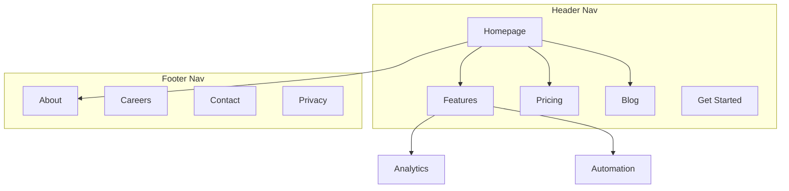

# Site Architecture

Information architecture guide: page hierarchy, navigation design, URL patterns, and internal linking for SEO.

---

## Site Types and Starting Points

| Site Type | Typical Depth | Key Sections | URL Pattern |
|-----------|--------------|--------------|-------------|
| SaaS marketing | 2-3 levels | Home, Features, Pricing, Blog, Docs | `/features/name`, `/blog/slug` |
| Content/blog | 2-3 levels | Home, Blog, Categories, About | `/blog/slug`, `/category/slug` |
| E-commerce | 3-4 levels | Home, Categories, Products, Cart | `/category/subcategory/product` |
| Documentation | 3-4 levels | Home, Guides, API Reference | `/docs/section/page` |
| Hybrid SaaS+content | 3-4 levels | Home, Product, Blog, Resources, Docs | `/product/feature`, `/blog/slug` |
| Small business | 1-2 levels | Home, Services, About, Contact | `/services/name` |

---

## Page Hierarchy Design

### The 3-Click Rule

Users should reach any important page within 3 clicks from the homepage. If critical pages are buried 4+ levels deep, something is wrong.

### Flat vs Deep

| Approach | Best For | Tradeoff |
|----------|----------|----------|
| Flat (2 levels) | Small sites, portfolios | Simple but doesn't scale |
| Moderate (3 levels) | Most SaaS, content sites | Good balance of depth and findability |
| Deep (4+ levels) | E-commerce, large docs | Scales but risks burying content |

**Rule of thumb**: Go as flat as possible while keeping navigation clean. If a nav dropdown has 20+ items, add a level of hierarchy.

### Hierarchy Levels

| Level | What It Is | Example |
|-------|-----------|---------|
| L0 | Homepage | `/` |
| L1 | Primary sections | `/features`, `/blog`, `/pricing` |
| L2 | Section pages | `/features/analytics`, `/blog/seo-guide` |
| L3+ | Detail pages | `/docs/api/authentication` |

---

## URL Structure

### Design Principles

1. **Readable by humans**: `/features/analytics` not `/f/a123`
2. **Hyphens, not underscores**: `/blog/seo-guide` not `/blog/seo_guide`
3. **Reflect the hierarchy**: URL path should match site structure
4. **Consistent trailing slash policy**: pick one and enforce it
5. **Lowercase always**: `/About` should redirect to `/about`
6. **Short but descriptive**: `/blog/landing-page-conversions` over `/blog/how-to-improve-landing-page-conversion-rates`

### URL Patterns by Page Type

| Page Type | Pattern | Example |
|-----------|---------|---------|
| Homepage | `/` | `example.com` |
| Feature page | `/features/{name}` | `/features/analytics` |
| Pricing | `/pricing` | `/pricing` |
| Blog post | `/blog/{slug}` | `/blog/seo-guide` |
| Blog category | `/blog/category/{slug}` | `/blog/category/seo` |
| Case study | `/customers/{slug}` | `/customers/acme-corp` |
| Documentation | `/docs/{section}/{page}` | `/docs/api/authentication` |
| Legal | `/{page}` | `/privacy`, `/terms` |
| Landing page | `/{slug}` or `/lp/{slug}` | `/free-trial`, `/lp/webinar` |
| Comparison | `/compare/{competitor}` or `/vs/{competitor}` | `/compare/competitor-name` |
| Integration | `/integrations/{name}` | `/integrations/slack` |

### Common Mistakes

- **Dates in blog URLs**: `/blog/2024/01/15/post-title` adds no value. Use `/blog/post-title`.
- **Over-nesting**: `/products/category/subcategory/item/detail` is too deep. Flatten where possible.
- **Changing URLs without redirects**: Every old URL needs a 301 redirect. Without them, you lose backlink equity.
- **IDs in URLs**: `/product/12345` is not human-readable. Use slugs.
- **Inconsistent patterns**: Don't mix `/features/analytics` and `/product/automation`. Pick one parent.

---

## Navigation Design

### Navigation Types

| Nav Type | Purpose | Placement |
|----------|---------|-----------|
| Header nav | Primary navigation, always visible | Top of every page |
| Dropdown menus | Organize sub-pages under parent | Expands from header items |
| Mega menu | Rich dropdowns with columns/images | Large sites with many sections |
| Footer nav | Secondary links, legal, sitemap | Bottom of every page |
| Sidebar nav | Section navigation (docs, blog) | Left side within a section |
| Breadcrumbs | Show current location in hierarchy | Below header, above content |
| Contextual links | Related content, next steps | Within page content |
| Sticky/utility nav | Login, language, search | Top bar above main header |

### Header Navigation Rules

- **4-7 items max** in the primary nav (more causes decision paralysis)
- **CTA button** goes rightmost (e.g., "Start Free Trial", "Get Started")
- **Logo** links to homepage (left side)
- **Order by priority**: most important/visited pages first
- If mega menu, limit to 3-4 columns
- Mobile: hamburger menu with same hierarchy, CTA prominent

### Footer Organization

Group footer links into columns:
- **Product**: Features, Pricing, Integrations, Changelog
- **Resources**: Blog, Case Studies, Templates, Docs
- **Company**: About, Careers, Contact, Press
- **Legal**: Privacy, Terms, Security

### Breadcrumbs

```
Home > Features > Analytics
Home > Blog > SEO Category > Post Title
```

Breadcrumbs should mirror the URL hierarchy. Every segment clickable except the current page. Implement `BreadcrumbList` schema markup on all breadcrumbs.

### Breadcrumb-URL Alignment

The breadcrumb trail must mirror the URL path:

| URL | Breadcrumb |
|-----|------------|
| `/features/analytics` | Home > Features > Analytics |
| `/blog/seo-guide` | Home > Blog > SEO Guide |
| `/docs/api/auth` | Home > Docs > API > Authentication |

---

## Visual Sitemap Output

### ASCII Tree Format

Use for quick hierarchy drafts:

```
Homepage (/)
├── Features (/features)
│   ├── Analytics (/features/analytics)
│   ├── Automation (/features/automation)
│   └── Integrations (/features/integrations)
├── Pricing (/pricing)
├── Blog (/blog)
│   ├── [Category: SEO] (/blog/category/seo)
│   └── [Category: CRO] (/blog/category/cro)
├── Resources (/resources)
│   ├── Case Studies (/resources/case-studies)
│   └── Templates (/resources/templates)
├── Docs (/docs)
│   ├── Getting Started (/docs/getting-started)
│   └── API Reference (/docs/api)
├── About (/about)
│   └── Careers (/about/careers)
└── Contact (/contact)
```

### Mermaid Diagram

Use for visual presentations and complex relationships:



**When to use which:**
- ASCII: quick drafts, text-only contexts, simple structures
- Mermaid: visual presentations, showing nav zones or linking patterns

### URL Map Table

For complete site planning, produce a URL map:

| Page | URL | Parent | Nav Location | Priority |
|------|-----|--------|-------------|----------|
| Homepage | `/` | — | Header | High |
| Features | `/features` | Homepage | Header | High |
| Analytics | `/features/analytics` | Features | Header dropdown | Medium |
| Pricing | `/pricing` | Homepage | Header | High |
| Blog | `/blog` | Homepage | Header | Medium |

---

## Internal Linking Strategy

### Link Types

| Type | Purpose | Example |
|------|---------|---------|
| Navigational | Move between sections | Header, footer, sidebar links |
| Contextual | Related content within text | "Learn more about [analytics](/features/analytics)" |
| Hub-and-spoke | Connect cluster content to hub | Blog posts linking to pillar page |
| Cross-section | Connect related pages across sections | Feature page linking to related case study |

### Internal Linking Rules

1. **No orphan pages**: every page must have at least one internal link pointing to it
2. **Descriptive anchor text**: "our analytics features" not "click here"
3. **5-10 internal links per 1000 words** of content (approximate guideline)
4. **Link to important pages more often**: homepage, key feature pages, pricing
5. **Use breadcrumbs**: free internal links on every page
6. **Related content sections**: "Related Posts" at page bottom

### Hub-and-Spoke Model

```
Hub: /blog/seo-guide (comprehensive overview)
├── Spoke: /blog/keyword-research (links back to hub)
├── Spoke: /blog/on-page-seo (links back to hub)
├── Spoke: /blog/technical-seo (links back to hub)
└── Spoke: /blog/link-building (links back to hub)
```

Each spoke links back to the hub. The hub links to all spokes. Spokes link to each other where relevant.

### Link Audit Checklist

- [ ] Every page has at least one inbound internal link
- [ ] No broken internal links (404s)
- [ ] Anchor text is descriptive
- [ ] Important pages have the most inbound internal links
- [ ] Breadcrumbs implemented on all pages
- [ ] Related content links exist on blog posts
- [ ] Cross-section links connect features to case studies, blog to product pages
